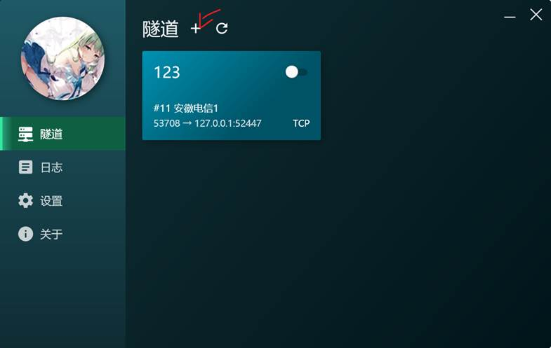
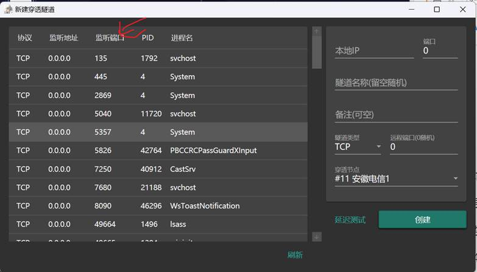
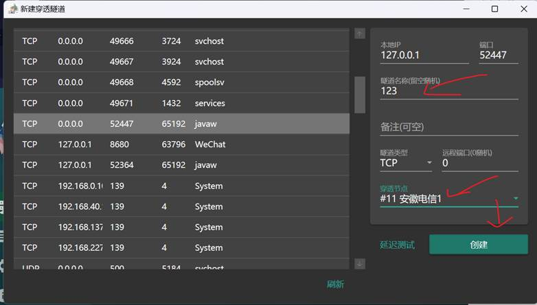
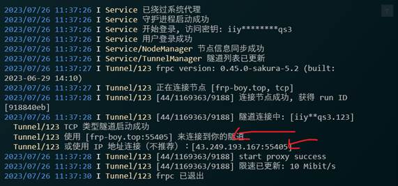
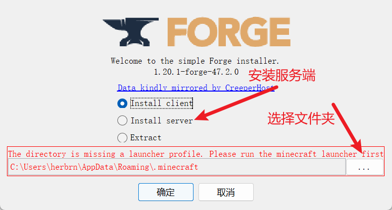
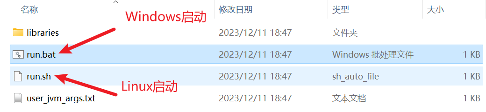
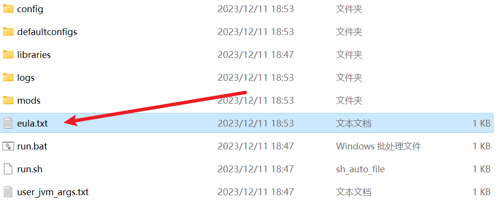
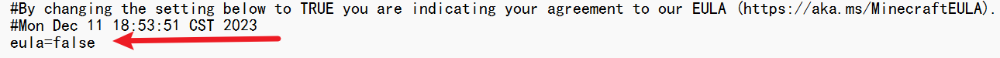
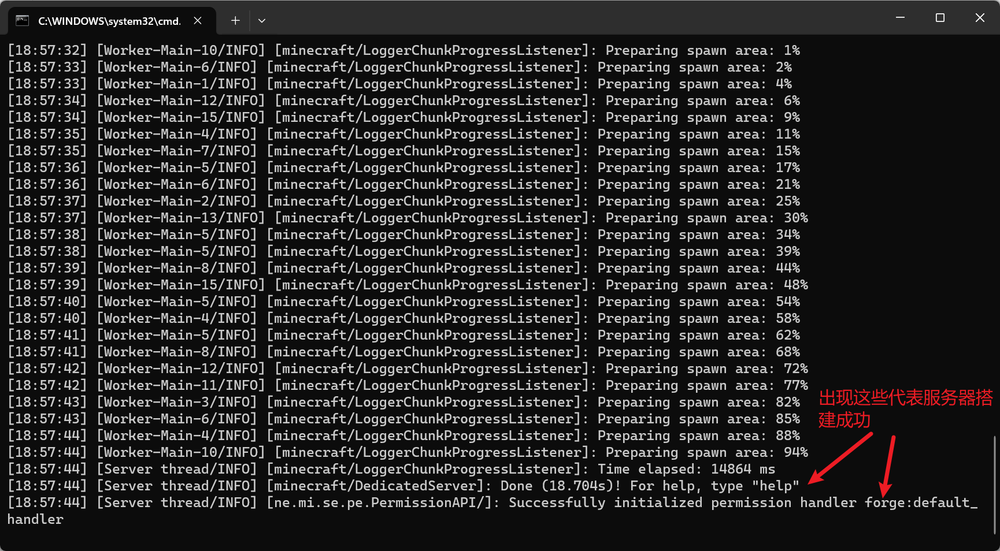

# 内网穿透

## 联机步骤

1. 房主开单人游戏—>点esc(键盘左上角)—>对局域网开放—>创建一个局域网世界—>记住端口号（在对话框，即左下角）如52447，按t可以唤回对话框

2. 房主打开安装的Sakura Launcher—>隧道+—>在监听端口下找到你房间的端口—>找到后点击—>右边设置隧道名称，下面选穿透节点，可以看下面的延迟测试可以看到哪个延迟低—>创建—

   

   ​		

3. 把刚才创建的启动

4. 点击日志—>找到联机的端口，把中括号里面的复制给你朋友

   

5. 房客也打开游戏（注意游戏版本与房主一致），点击多人连接—>直接连接，把刚复制的粘贴上去，连接即可

# 创建服务器

## 准备

1. 在这个[网站](https://files.minecraftforge.net/net/minecraftforge/forge/)下载对应版本

2. 安装：最好准备一个专门的文件夹进行放置

   ​	

3. 启动bat

   ​	

4. 完成后打开这个文档进行修改

   ​	

​			

改成true保存，再打开run.bat

5. 现在打开mc直接连接127.0.0.1即可连接到本服务器，需要关闭输入stop即可

​	

## 本机做服务器

也是内网穿透，除非你有ip

1. 打开[神卓互联](https://www.shenzhuohl.com/)官网，注册登录

2. 打开异地组网下的我的网络

   ​	

3. 添加网络后添加成员，你自己有一个，你朋友也要有

   ​	

4. 在这个[网站](https://www.shenzhuohl.com/yunzuwang.html)下载对应客户端，安装，登录。你的朋友也需要下载这个客户端，并且要把创建的成员账号和密钥给他。你们登录就可以在同一个局域网下，你的本机运行服务端就可以进行游戏了。

5. 添加mod和world文件进行替换可以玩原来的存档，但你身上携带的东西没有了，因为你是作为一个新的用户进行游玩，所以替换前最好将身上的装备放在箱子里

## 云服务器

云服务器配置看人数，两人2核2G即可，人多最好配置就好一些，带宽要高一些，要不然一直加载不进去。1M是不够的，我估计得3M往上

1. [从零开始使用云服务器搭建 Minecraft 服务器 – 颢天 (zouht.com)](https://www.zouht.com/2954.html)

